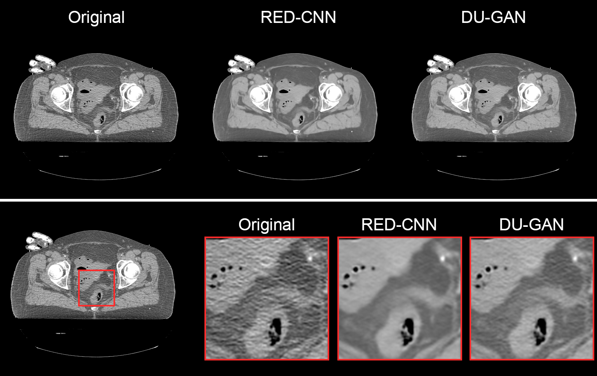

!!! info "Prerequisite"
    This example assumes you have the package `ldct-benchmark` installed. Please refer to [Getting Started](../getting_started.md) for instructions on how to do this.

The pretrained models provided as part of the [model hub](../model_hub.md) can be used to denoise any CT DICOM dataset. See [here][implemented-algorithms] for a list of all available algorithms.

Let's use two of these models, RED-CNN[^1] and DU-GAN[^2] to denoise DICOM slices from the openly available *Visible Human CT Dataset*[^3]
!!! warning "Warning"
    This is an **out-of-distribution** setting as data of the *Visible Human CT Dataset* were acquired with a (29 year old) scanner and scan-protocols that are far from the training data distribution. The results of the models on such data should be interpreted with caution.

[^1]: H. Chen, Y. Zhang, M. K. Kalra, F. Lin, Y. Chen, P. Liao, J. Zhou, and G. Wang, “Low-dose CT with a residual encoder-decoder convolutional neural network,” IEEE Transactions on Medical Imaging, vol. 36, no. 12, pp. 2524–2535, Dec. 2017
[^2]: Z. Huang, J. Zhang, Y. Zhang, and H. Shan, “DU-GAN: Generative adversarial networks with dual-domain U-Net-based discriminators for low-dose CT denoising,” IEEE Transactions on Instrumentation and Measurement, vol. 71, pp. 1–12, 2022.
[^3]: McCarville, Alan, 2023, "Visible Human Project CT Datasets Male and Female", <https://doi.org/10.7910/DVN/3JDZCT>, Harvard Dataverse, V1

Start by importing some modules:

```python
import os
import requests  # For downloading the data
from ldctbench.hub.utils import denoise_dicom  # For applying the models
```

We'll download the first 10 slices of the female pelvis data to a new folder `./visible-human/orig`:

```python
# Create folders
folder = "./visible-human"
orig_data = os.path.join(folder, "orig")

if not os.path.exists(orig_data):
    os.mkdir(orig_data)

# Define base url and data ids of first 10 pelvis slices
data_url = "https://dataverse.harvard.edu/api/access/datafile/"
data_ids = [
    "7576771",
    "7576821",
    "7576849",
    "7576854",
    "7576780",
    "7576778",
    "7576766",
    "7576779",
    "7576720",
    "7576771",
]

# Download the data 
for i, data_id in enumerate(data_ids):
    r = requests.get(data_url + data_id)
    with open(os.path.join(orig_data, f"{i}.dcm"), "wb") as f:
        f.write(r.content)
```

The function [ldctbench.hub.utils.denoise_dicom][] can be used to apply a pretrained model either to a single DICOM file or a folder containing multiple DICOM files. The processed DICOMs differ only in the `PixelData`, all other DICOM tags are identical to those in the source files. We'll use this function to apply the RED-CNN and DU-GAN models to all 10 slices we just downloaded:

```python
# Apply RED-CNN and DU-GAN and store the processed DICOMs 
# to ./visible-human/redcnn and ./visible-human/dugan
for method in [Methods.REDCNN, Methods.DUGAN]:
    denoise_dicom(
        dicom_path=orig_data,
        savedir=os.path.join(folder, method.value),
        method=method,
        device=torch.device("mps"),  # Use "mps" for Apple Silicon, "cuda" for NVIDIA GPUs or "cpu" for CPU
    )
```
The denoised DICOMs can be loaded with any DICOM viewer. Below we show a comparison of the original and denoised images:



Here we find that both RED-CNN and DU-GAN reduce the noise in the images. Additionally, it can be observed that RED-CNN smooths the images more than DU-GAN does which can be attributed to the fact that DU-GAN is trained in an adversarial fashion, whereas RED-CNN is trained with a simple mean squared error loss.