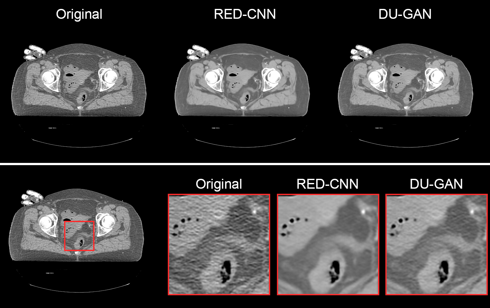

!!! info "Prerequisite"
    This example assumes you have the package `ldct-benchmark` installed. Please refer to [Getting Started](../getting_started.md) for instructions on how to do this.

The pretrained models provided as part of the [model hub](../model_hub.md) can be used to denoise any CT DICOM dataset. See [here][implemented-algorithms] for a list of all available algorithms.

Let's use two of these models, RED-CNN[^1] and DU-GAN[^2] to denoise DICOM slices from the CT data of the *NLM Visible Human Project*[^3] which can be downloaded from [NCI Imaging Data Commons](https://portal.imaging.datacommons.cancer.gov/explore/filters/?collection_id=nlm_visible_human_project){:target="_blank"}.
!!! warning "Warning"
    This is an **out-of-distribution** setting as data of the *Visible Human CT Dataset* were acquired with a (31 year old) scanner and scan-protocols that are far from the training data distribution. The results of the models on such data should be interpreted with caution.

[^1]: H. Chen, Y. Zhang, M. K. Kalra, F. Lin, Y. Chen, P. Liao, J. Zhou, and G. Wang, “Low-dose CT with a residual encoder-decoder convolutional neural network,” IEEE Transactions on Medical Imaging, vol. 36, no. 12, pp. 2524–2535, Dec. 2017
[^2]: Z. Huang, J. Zhang, Y. Zhang, and H. Shan, “DU-GAN: Generative adversarial networks with dual-domain U-Net-based discriminators for low-dose CT denoising,” IEEE Transactions on Instrumentation and Measurement, vol. 71, pp. 1–12, 2022.
[^3]: M. J. Ackerman, "The Visible Human Project," in Proceedings of the IEEE, vol. 86, no. 3, pp. 504-511, March 1998, doi: 10.1109/5.662875.

Start by importing some modules:

```python
# Make sure that s5cmd is installed! (pip install s5cmd)
import os
import torch
from ldctbench.hub import Methods
from ldctbench.hub.utils import denoise_dicom
```

We'll download 10 slices of the female pelvis data to a new folder `./visible-human/orig`:

```python
# Create folders
folder = "./visible-human"
orig_data = os.path.join(folder, "orig")

if not os.path.exists(orig_data):
    os.makedirs(orig_data)

# Filenames of 10 pelvis slices
files = [
    "496788de-f0f0-41fd-b19a-6da82268fd0a.dcm",
    "a535613b-de28-4080-850a-f5647ee33c96.dcm",
    "9f7ef52e-c93d-430a-9038-970a47e95e3a.dcm",
    "0c7ac013-41e3-404f-9081-9e0cc18f4f67.dcm",
    "2591aad8-7673-4a12-98e0-8984dafa5175.dcm",
    "28494e9b-d274-4310-a0ed-15d4220e1dc1.dcm",
    "f5e41514-d30a-4cef-81ac-fce50b4743d8.dcm",
    "21292f8c-072c-4223-859a-1e70bbc87a42.dcm",
    "5a214c6b-6898-43c1-89f3-52c967dff39e.dcm",
    "cd90f914-2b13-4cd9-9119-976a3c5721c1.dcm",
]

# Download the data
for file in files:
    os.system(
        f's5cmd --no-sign-request --endpoint-url https://s3.amazonaws.com cp "s3://idc-open-data/b9cf8e7a-2505-4137-9ae3-f8d0cf756c13/{file}" visible-human/orig'
    )
```

The function [ldctbench.hub.utils.denoise_dicom][] can be used to apply a pretrained model either to a single DICOM file or a folder containing multiple DICOM files. The processed DICOMs differ only in the `PixelData`, all other DICOM tags are identical to those in the source files. We'll use this function to apply the RED-CNN and DU-GAN models to all 10 slices we just downloaded:

```python
# Apply RED-CNN and DU-GAN and store the processed DICOMs
# to ./visible-human/redcnn and ./visible-human/dugan
for method in [Methods.REDCNN, Methods.DUGAN]:
    denoise_dicom(
        dicom_path=orig_data,
        savedir=os.path.join(folder, method.value),
        method=method,
        device=torch.device("mps"),  # Use "mps" for Apple Silicon, "cuda" for NVIDIA GPUs or "cpu" for CPU
    )
```
The denoised DICOMs can be loaded with any DICOM viewer. Below we show a comparison of the original and denoised images:

<figure markdown="span">
  
  <figcaption>Ten slices of the NLM Visible Human Project denoised using RED-CNN and DU-GAN. Original data is courtesy of the U.S. National Library of Medicine.</figcaption>
</figure>

Here we find that both RED-CNN and DU-GAN reduce the noise in the images. Additionally, it can be observed that RED-CNN smooths the images more than DU-GAN does which can be attributed to the fact that DU-GAN is trained in an adversarial fashion, whereas RED-CNN is trained with a simple mean squared error loss.