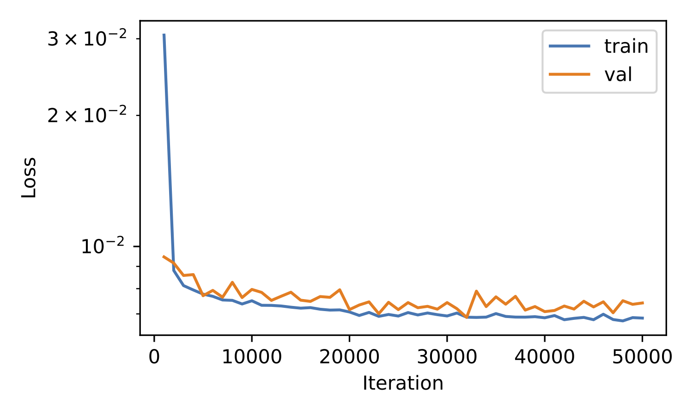

!!! info "Prerequisite"
    This example assumes you have:

    1. the package `ldct-benchmark` installed in editable mode 
    2. the LDCT dataset downloaded to a folder `path/to/ldct-data`
    3. The environment variable `LDCTBENCH_DATAFOLDER` set to that folder

    Please refer to [Getting Started](../getting_started.md) for instructions on how to do these steps.

## Implement a custom method
To add a custom method to the benchmark suite we must follow these steps:

1. Create a folder for the new method in `ldctbench/methods`. The folder must have the following files
    - `__init__.py`
    - `argparser.py`: Should implement a method `add_args()` that takes as input an `argparse.ArgumentParser`, adds custom arguments and returns it.
    - `network.py`: Should implement the model as `class Model(torch.nn.Module)`.
    - `Trainer.py`: Should imeplement a `Trainer` class. This class should be initialized with `Trainer(args: argparse.Namespace, device: torch.device)` and implement a `fit()` method that trains the network. A base class is provided in `methods/base.py`.

2. Add the method to `METHODS` in `argparser.py`.

Let's say we want to implement a method called `simplecnn` which is just a shallow 3-layer CNN. For this, the folder `ldctbench/methods/simplecnn` should contain the following files:

=== "argparser.py"
    ```python
    from argparse import ArgumentParser


    def add_args(parser: ArgumentParser) -> ArgumentParser:
        parser.add_argument(
            "--n_hidden", type=int, help="Number of filters in the hidden layer of the CNN"
        )
        return parser
    ```
=== "network.py"
    ```python
    from argparse import Namespace

    import torch.nn as nn


    class Model(nn.Module):
        """An simple network Conv -> ReLU -> Conv -> ReLU -> Conv"""

        def __init__(self, args: Namespace):
            super().__init__()
            self.net = nn.Sequential(
                nn.Conv2d(1, args.n_hidden, 3, padding=1),
                nn.ReLU(),
                nn.Conv2d(args.n_hidden, args.n_hidden, 3, padding=1),
                nn.ReLU(),
                nn.Conv2d(args.n_hidden, 1, 3, padding=1),
            )

        def forward(self, x):
            return self.net(x)
    ```

=== "Trainer.py"
    ```python
    from argparse import Namespace

    import torch
    import torch.nn as nn

    from ldctbench.methods.base import BaseTrainer
    from ldctbench.utils.training_utils import setup_optimizer

    from .network import Model


    class Trainer(BaseTrainer):
        """Trainer class for a simple CNN"""

        def __init__(self, args: Namespace, device: torch.device):
            """Init function

            Parameters
            ----------
            args : Namespace
                Arguments to configure the trainer.
            device : torch.device
                Torch device to use for training.
            """
            super().__init__(args, device)
            self.criterion = nn.MSELoss()
            self.model = Model(args).to(self.dev)
            if isinstance(self.args.devices, list):
                self.model = nn.DataParallel(self.model, device_ids=self.args.devices)
            self.optimizer = setup_optimizer(args, self.model.parameters())
    ```
=== "__init__.py"
    ```python
    # An empty file
    ```

Additionally, we have to change `METHODS` in `ldctbench/argparser.py` to include the new method:

=== "ldctbench/argparser.py"
    ```python
    ...
    METHODS = [
        "bilateral",
        "cnn10",
        "dugan",
        "qae",
        "redcnn",
        "resnet",
        "transct",
        "wganvgg",
        "simplecnn"  # <-- added here
    ]
    ...
    ```

## Train a method
You can train the method using
```shell
python train.py --arg1 val1 --arg2 val2
```
or, alternatively
```shell
python train.py --config configs/<method>.yaml
```
if a `.yaml` file containing all necessary arguments to run the method is provided in `configs/`.

Let us now train the `simplecnn` method with the following config file that we place in `configs/`
=== "configs/simplecnn.yaml"
    ```yaml
    optimizer: adam  # Which optimizer to use
    adam_b1: 0.9  # Adam's beta1
    adam_b2: 0.999  # Adam's beta2
    cuda: true  # Use CUDA
    data_norm: meanstd  # Data normalization
    data_subset: 1.  # Fraction of the dataset to use (1.0 = all data)
    devices: 0  # Which GPU to use
    dryrun: true  # Do not sync results to wandb
    eval_patchsize: 128  # Patchsize for evaluation
    iterations_before_val: 1000  # Number of iterations before validation
    lr: 0.0001  # Learning rate
    max_iterations: 50000 # Maximum number of iterations 
    mbs: 64 # Mini-batch size
    num_workers: 8 # Number of workers for data loading
    patchsize: 64  # Patchsize for training
    seed: 1332  # Random seed
    trainer: simplecnn  # Our new method
    valsamples: 8  # Number of validation samples to log
    n_hidden: 64  # Number of filters in the hidden layer of the CNN
    ```

Training the method is then done by running
```shell
python train.py --config configs/simplecnn.yaml
```
and should take approximately 25 minutes on a single GPU.
The training logs are stored to a folder `wandb/offline-run-<timestamp>/files`. Let's have a look at the plot of training and validation loss that we find in that folder:

<figure markdown="span">
  { width="500" }
  <figcaption>Training and validation loss for the 'simplecnn' method</figcaption>
</figure>
